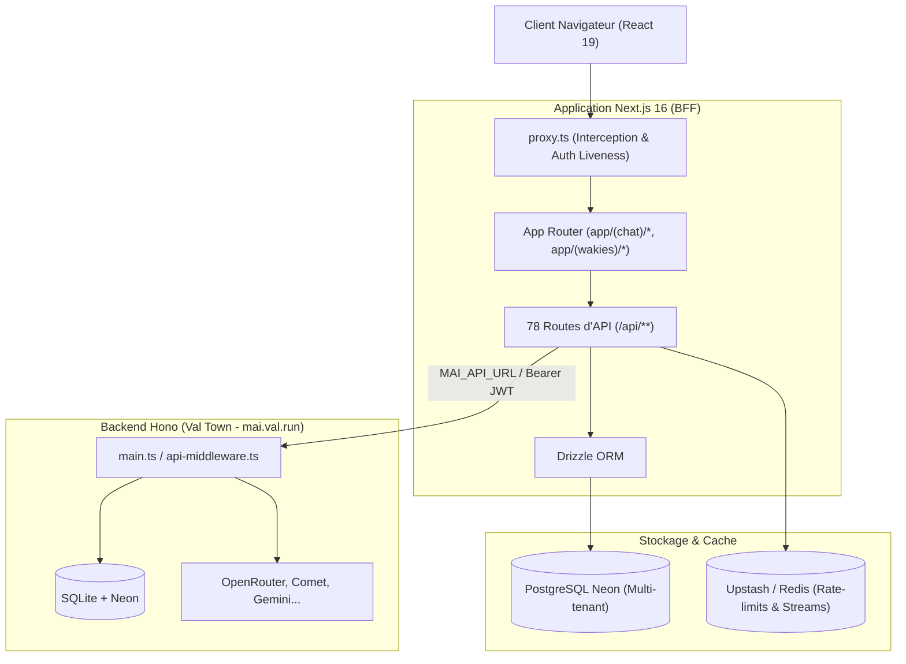

# 🏛️ Architecture globale de mAI Web

mAI Web est conçu autour d'une architecture découplée combinant un **BFF (Backend-For-Frontend) Next.js 16** et un **Backend haute performance Hono** hébergé sur Val Town.

---

## 1. Rôle du BFF Next.js 16

L'application Next.js gère :
- **Le rendu de l'interface utilisateur** (React 19.2, streaming React Server Components).
- **L'authentification de session** : Lecture du cookie HTTP-only `mai_session_token`, validation de session avec `getMaiUser()`, et passerelle pour les composants clients.
- **La persistance des données utilisateur** : Conversations, messages, artefacts, configurations d'agents, espaces et pages Wakies, préférences via PostgreSQL Neon et Drizzle ORM.
- **La normalisation des requêtes amont** : Les routes sous `app/(chat)/api/**/route.ts` vérifient les autorisations locales et les quotas avant de contacter le backend distant avec `lib/api/error-response.ts`.

---

## 2. Rôle du Backend Hono (Val Town)

Le backend hébergé sur Val Town (`main.ts` et ses modules) assure :
- **L'orchestration des modèles IA** : Abstraction des fournisseurs de LLMs (OpenRouter, OpenAI, Anthropic, Gemini, Groq...).
- **Les quotas temps réel** : Comptabilisation des jetons et rate limiting via Redis.
- **Le backend social de Vibe** : Endpoints REST `/v1/*` gérant les flux, publications, réactions, commentaires arborescents et notifications.
- **La synthèse vocale (TTS) et génération d'images**.

---

## 3. Communication sécurisée et isolation

- **Validation des URLs amont (`safe-fetch.ts`)** : Toute requête sortante vers un domaine externe valide l'adresse IP de destination pour bloquer les attaques SSRF (Server-Side Request Forgery) sur les adresses privées (`127.0.0.1`, `169.254.169.254`, `10.0.0.0/8`...).
- **Secrets MCP isolés** : Les clés et configurations des serveurs MCP sont chiffrées à l'aide d'un algorithme AES-256-GCM avec rotation d'identifiants (`MCP_ENCRYPTION_KEY`).
