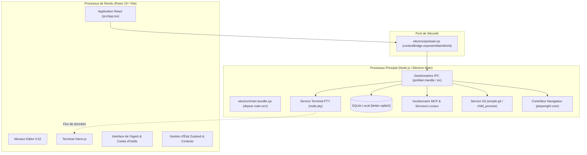

# 🏛️ Architecture Logicielle de mAI Coder

mAI Coder s'appuie sur une séparation stricte et sécurisée entre le processus principal Node.js (Main Process) et l'interface utilisateur web (Renderer Process), orchestrée par Electron.

---

## 1. Processus Principal (`main-src/`)

Le processus principal a pour responsabilités :
- **Cycle de vie applicatif** : Création de la fenêtre `BrowserWindow`, gestion des menus natifs, synchronisation des fenêtres et auto-updater.
- **Accès système bas niveau** :
  - `better-sqlite3` pour la persistance locale des fils de discussion, de l'historique et des configurations.
  - `node-pty` pour émuler un terminal complet multiplateforme (PowerShell / cmd sous Windows, bash / zsh sous macOS et Linux).
  - `playwright-core` pour le pilotage d'un navigateur headless ou visible servant aux recherches et tests web de l'agent.
- **Client MCP** : Gestion des connexions aux serveurs MCP locaux (stdio) et distants (SSE).

---

## 2. Processus de Rendu (`src/`)

Construit avec React 19 et packagé par Vite sous `dist/` :
- **Éditeur Monaco (`@monaco-editor/react`)** : Coloration syntaxique, autocomplétion, affichage des diffs avant/après et navigation par symboles.
- **Terminal Xterm.js (`@xterm/xterm`)** : Rendu fluide du flux du terminal avec gestion des dimensions (`@xterm/addon-fit`) et recherche (`@xterm/addon-search`).
- **Composants Agent** : Déroulement de la réflexion du modèle, rendu des cartes d'outils, visualisation des plans et validations humaines.

---

## 3. Communication Inter-Processus (IPC)

Pour garantir la sécurité contre les attaques par injection de code malveillant :
- `nodeIntegration: false` et `contextIsolation: true` sont activés sur toutes les fenêtres.
- Le fichier `electron/preload.cjs` n'expose qu'une API typée et restreinte (`window.electronAPI`), interdisant tout accès arbitraire aux modules Node.js natifs.
